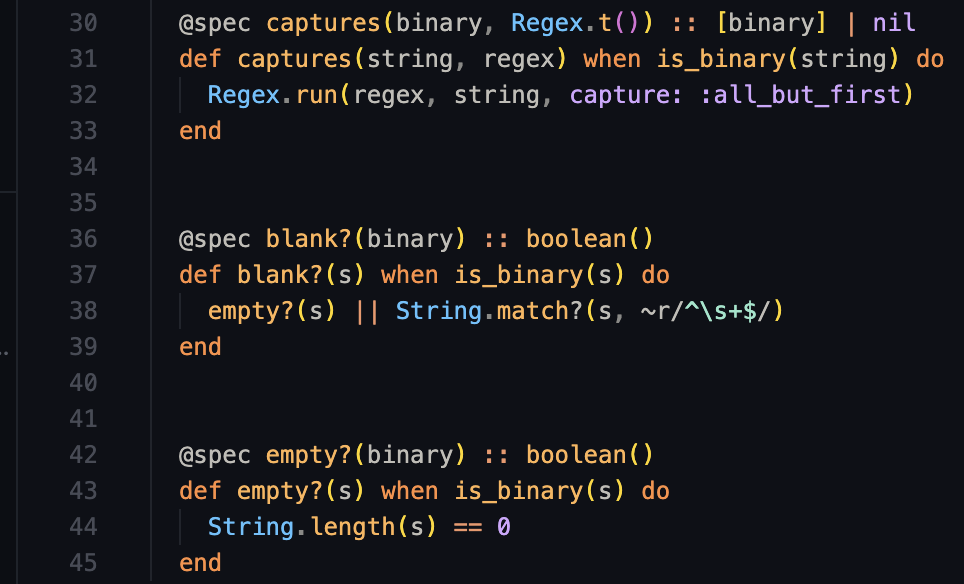
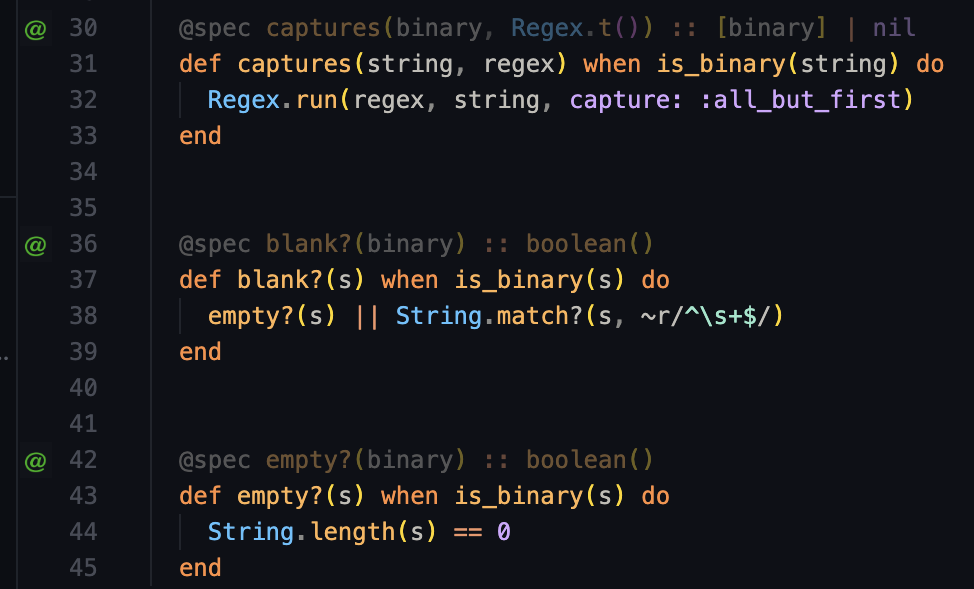

# ByeSpec

> This is my first VS Code extension. I have no idea what I'm doing. 😅

ByeSpec is a VSCode plugin to dim or hide @specs in Elixir source files.

When active it fades Elixir `@spec` lines:

## Screenshots:

### Before:

### After:

This is a fork of [byesig for Ruby with Sorbet](https://github.com/itarato/byesig).

## TODO 

* Implement @spec folding.

## Options

- VSCode commands: force show and hide
- VSCode configuration:
  - opacity
  - backgroundColor
  - plugin on/off
  - fold on/off (Doesn't work too well at the moment)
  - gutter icon on/off

## Contribution

Still super beta, any feedback / issue / pull request is welcomed.
